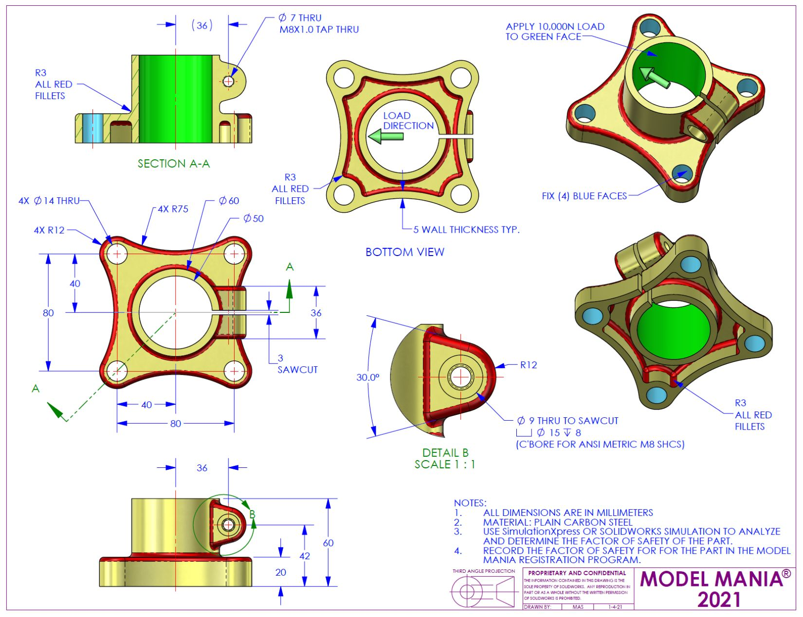
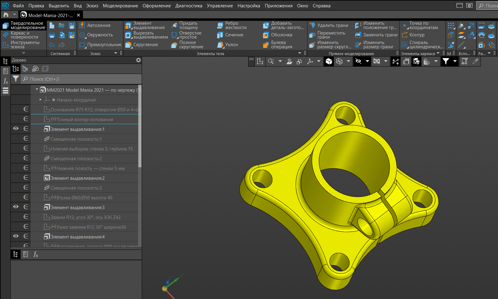
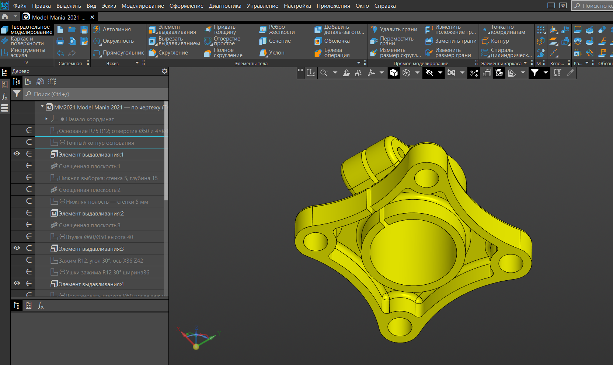
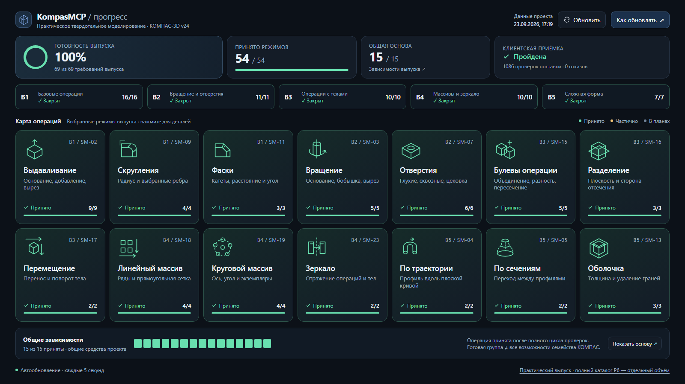

# Kompas3D MCP-сервер для КОМПАС-3D v24

## Пример: деталь по чертежу, собранная агентом

**Достаточно дать чертёж.** С сильной моделью от человека не требуется ручного построения в КОМПАСе:
агенту отдают чертёж и задачу — деталь он строит сам, вызовами инструментов этого MCP. Сервер отвечает
не «успехом» вызова, а тем, что измерил на модели.

*Задание конкурса **Model Mania 2021** (SOLIDWORKS). Права на чертёж принадлежат SOLIDWORKS.*

*Деталь, построенная агентом (**ChatGPT 6.0 Astra, режим размышлений Low**) по этому чертежу через
MCP: два вида одного тела — со стороны бобышки и с обратной. Слева — дерево построения, которое агент
собрал сам; каждый его шаг сервер подтверждал измерением.*

**Как повторить.** Установить лицензированный КОМПАС-3D v24 x64, собрать сервер (команды — в
[обзоре](KOMPAS3D_MCP.md), раздел «Требования и запуск»), подключить его к ИИ-агенту и дать агенту
чертёж и задачу: дальше агент строит вызовами инструментов, а сервер отвечает тем, что измерил.

**Что это.** MCP-сервер, через который ИИ-агент строит и проверяет настоящие детали и сборки в
установленном КОМПАС-3D v24 по COM. У каждой мутирующей операции есть проверяемое последствие —
объём, число тел и граней, перечитанный параметр признака, состояние после `save → close → reopen`;
если вызов прошёл, а измерение этого не подтвердило, ответ помечается более низким уровнем проверки,
а не «успех». Полный список инструментов и их число — в [обзоре](KOMPAS3D_MCP.md), схемы —
в [`schemas/`](schemas/).

**Что нужно, чтобы это собрать и запустить.** Windows x64, .NET SDK 10 (`global.json` закрепляет
10.0.401) и **установленная лицензированная КОМПАС-3D v24 x64**. Interop берётся из каталога
установки и в репозиторий не входит; без КОМПАСа сборка адаптера отказывает с внятным сообщением —
заглушки COM-слой не имеет. Сборка в облачном CI по этой причине невозможна, и это свойство проекта,
а не упущение: проверка изменений идёт на машине с установленным КОМПАСом. Команды — в
[обзоре](KOMPAS3D_MCP.md), раздел «Требования и запуск».

**Что в публикацию не входит и почему** — названо одним разделом в [обзоре](KOMPAS3D_MCP.md):
доказательства прогонов и приёмки, рабочие данные, модели заказчика, локальные конфигурации и
делопроизводство наряда. Публикуется индекс git, а не рабочее дерево; список задан `.gitignore`
признаком роли и проверяется стражем [`scripts/verify-publish-set.py`](scripts/verify-publish-set.py).

## Что коннектор умеет сейчас

**Обязательный набор выпуска закрыт полностью: 54 режима из 54 и 15 зависимостей из 15.** Это выпуск
«Практическое твердотельное моделирование v24» (`mechanical-core-v1`, редакция 1.1) на
КОМПАС-3D v24.0.0.2799 x64. Коннектор отдаёт **50 инструментов**; ниже — 14 семейств операций
обязательного объёма, 17 инструментов, которые их закрывают, и по каждому семейству — сколько
режимов закрыто.

| Семейство | Что именно | Режимов | Инструменты MCP |
|---|---|---|---|
| SM-02 Выдавливание | Основание, добавление, вырез | 9/9 | `kompas_extrude` |
| SM-09 Скругления | Радиус и выбранные рёбра | 4/4 | `kompas_fillet`, `kompas_get_feature`, `kompas_update_feature` |
| SM-11 Фаски | Катеты, расстояние и угол | 3/3 | `kompas_chamfer` |
| SM-03 Вращение | Основание, бобышка, вырез | 5/5 | `kompas_rotated` |
| SM-07 Отверстия | Глухие, сквозные, цековка | 6/6 | `kompas_hole` |
| SM-15 Булевы операции | Объединение, разность, пересечение | 5/5 | `kompas_boolean` |
| SM-16 Разделение | Плоскость и сторона отсечения | 3/3 | `kompas_cut_by_plane`, `kompas_split` |
| SM-17 Перемещение | Перенос и поворот тела | 2/2 | `kompas_reposition` |
| SM-18 Линейный массив | Ряды и прямоугольная сетка | 4/4 | `kompas_pattern_grid` |
| SM-19 Круговой массив | Ось, угол и экземпляры | 4/4 | `kompas_pattern_circular` |
| SM-23 Зеркало | Отражение операций и тел | 2/2 | `kompas_pattern_mirror` |
| SM-04 По траектории | Профиль вдоль плоской кривой | 2/2 | `kompas_sweep` |
| SM-05 По сечениям | Переход между профилями | 2/2 | `kompas_loft` |
| SM-13 Оболочка | Толщина и удаление граней | 3/3 | `kompas_shell` |

**Чем это подтверждено, а не заявлено.** Закрытие режима требует, чтобы все десять действий его строки
матрицы — `discover`, `create`, `read`, `edit`, `rebuild`, `save_reopen`, `suppress_restore`,
`delete_dependencies`, `negative_tests`, `geometry_validation` — были `verified` либо обоснованно
`not_applicable`. В 54 обязательных режимах это **540 ячеек: 539 `verified` и один обоснованный
`not_applicable`** (у зеркального массива выбранных операций действие `edit` неприменимо: свойство
`SaveInitialObjects` к этому типу операции не относится — по справке вендора). То есть закрытие
держится на прогонах, а не на ярлыках.

**Остальные 33 инструмента** — жизненный цикл документа, эскизы, чтение, измерение и обмен:
`kompas_capabilities`, `kompas_close_document`, `kompas_connect`, `kompas_create_aux_geometry`, `kompas_create_document`, `kompas_create_sketch`, `kompas_delete_feature`, `kompas_disconnect`, `kompas_edit_sketch`, `kompas_edit_sketch_entity`, `kompas_export_image`, `kompas_export_step`, `kompas_finish_sketch`, `kompas_get_context`, `kompas_get_pattern`, `kompas_get_sketch_status`, `kompas_health`, `kompas_import_step`, `kompas_list_aux_geometry`, `kompas_list_bodies`, `kompas_list_documents`, `kompas_list_features`, `kompas_list_sketch_entities`, `kompas_measure`, `kompas_open_document`, `kompas_probe_units`, `kompas_read_topology`, `kompas_rebuild`, `kompas_resolve_selection`, `kompas_save_document`, `kompas_set_feature_suppressed`, `kompas_set_sketch_plane`, `kompas_update_plane`.

**Что осталось за обязательным объёмом — названо, а не умолчано.** В профиле выпуска **57** режимов:
54 обязательных (закрыты все) и три вне обязательного объёма — `SM-04.boss` (родные приклеивание и
вырезание по траектории, отложено), `SM-15.union.mode_save_base_copy` (сохранение копии базового
объекта, следующий этап) и `AUX-IMAGE.raster_export` (растровый снимок модели — закрыт, но
вспомогательный). Каталог операций шире выпуска: **32 семейства**, из них 14 в обязательном объёме;
полное покрытие продолжается отдельно — [план реализации](coverage/solid-v24/implementation-plan.md).

**Откуда эти числа.** Они пересчитываются из публикуемых файлов, а не берутся из картинки:
[`matrix.json`](coverage/solid-v24/matrix.json) — состояния действий и доказательства,
[`mechanical-core-v1.json`](coverage/solid-v24/release-profiles/mechanical-core-v1.json) — обязательные
режимы и зависимости, [`catalog.json`](coverage/solid-v24/catalog.json) — каталог. Тот же расчёт умеет
показать визуальный дашборд: генератор
[`scripts/project-progress.mjs`](scripts/project-progress.mjs) публикуется, а собранная им страница
`docs/progress/` — нет, это рабочий инструмент наряда.

---

# Kompas3D MCP — техническое задание для модели-разработчика

> Краткое описание проекта для читателя, который видит репозиторий впервые, —
> **[Kompas3D MCP](KOMPAS3D_MCP.md)**. Ниже — постановка задачи; текущее состояние реализации —
> [docs/STATUS.md](docs/STATUS.md), чем подтверждено каждое утверждение —
> `docs/acceptance/INDEX.md` (доказательства наряда в публичный набор не входят, см. обзор).

## Читать в этом порядке

1. [ТЗ и архитектура](docs/01_TECHNICAL_SPEC.md).
2. [Контракты инструментов и данных](docs/02_TOOL_CONTRACTS.md).
3. [Приёмочные испытания и этапы](docs/03_ACCEPTANCE_PLAN.md).
4. [Опыт API, исходные материалы и известные ошибки](docs/04_KOMPAS_API_NOTES.md).
5. Задание модели-разработчику — `DEVELOPER_HANDOFF.md` (в публичный набор не входит).

`reference/` содержит копии ранее написанных скриптов и отчётов проекта EH70. Это справочные материалы, не готовая реализация MCP. Не запускать старые генераторы на рабочей папке заказчика: они содержат жёсткие пути, создают приложения/документы и могут перезаписать файлы.

**Пометка 23.09.2026.** `reference/` в публичный набор **не входит** — это признак роли в `.gitignore`,
а не перечень имён: справочные материалы рабочего дерева содержат жёсткие локальные пути и для сборки,
запуска и приёмки не требуются. Фраза выше оставлена как часть ТЗ v1.0 — так её читали на момент
постановки, — а не переписана. Полный перечень того, что не публикуется, и как читать ссылки на эти
артефакты, — в [обзоре](KOMPAS3D_MCP.md), раздел «Что намеренно не входит в публичный репозиторий».

При противоречии старого скрипта и этого ТЗ приоритет имеет ТЗ. Не выдавать непроверенный импорт, развёртку или демонстрационный сценарий за готовую универсальную функцию.

Результат будущей разработки: локальный MCP-сервер Windows с открытым заказчику исходным кодом, подключением к КОМПАС-3D v24, устойчивой работой с деталями/сборками, проверками и производственными экспортами. Доступ к внешнему сервису активации для собственного сервера не нужен.

### Ошибка NuGet path1 в окружении агента

Если окружение запуска теряет стандартные переменные Windows, используйте scripts/dotnet-project.ps1. Проверка и команды: [docs/restore-environment.md](docs/restore-environment.md). Переустановка SDK для этого сбоя не требуется.