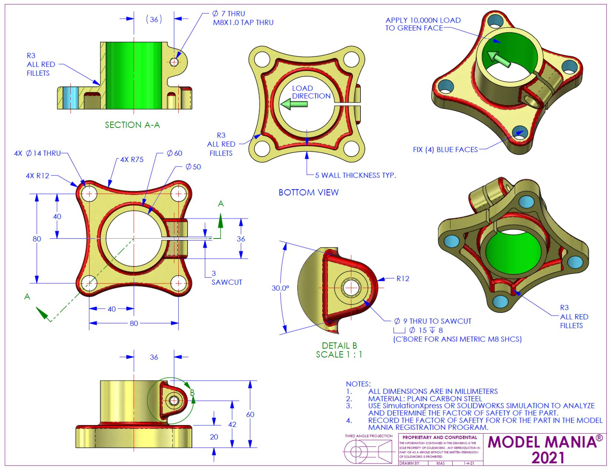
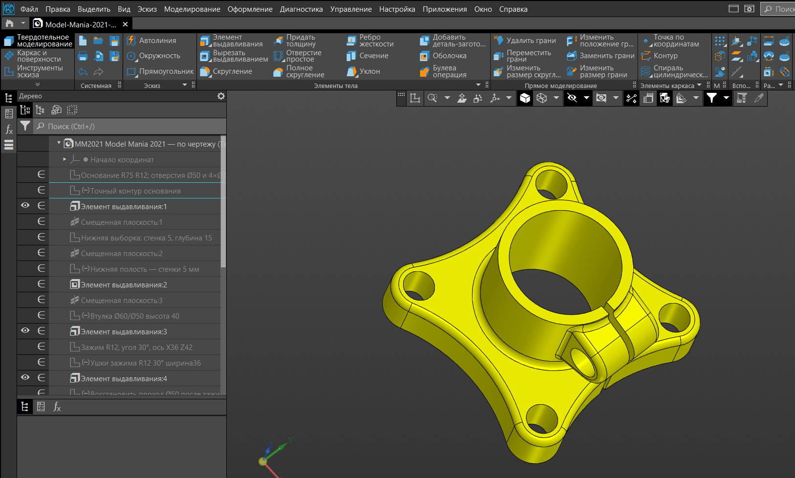
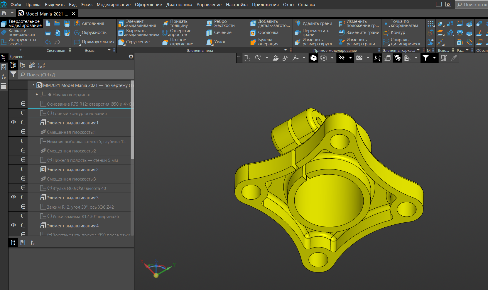
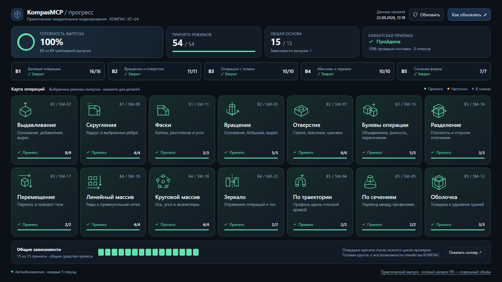

# Kompas3D MCP

**MCP-сервер для КОМПАС-3D v24: ИИ-агент строит и проверяет настоящие детали и сборки, а сервер
отвечает тем, что измерил на модели, а не тем, что вызов «прошёл».**

[](LICENSE)


> *English summary.* A Model Context Protocol server that lets an AI agent drive a real, licensed
> KOMPAS-3D v24 (x64) over COM: parts, sketches, features, patterns, booleans, assemblies and mates,
> STEP and image export. Every mutating call reports a measured verification level (volume, bodies,
> faces, re-read parameters, save/reopen), journals operations for idempotent retries, rejects stale
> revisions, and is confined to configured disk roots. No arbitrary code execution. 63 tools,
> MIT licensed. Documentation is in Russian.

## Быстрая установка через Codex


Если у вас Windows, установлен КОМПАС-3D v24 и есть [Codex](https://developers.openai.com/codex),
ничего скачивать и собирать вручную не нужно. Скопируйте в Codex этот текст:

```text
https://github.com/SergeySklyarov/Kompas3D-MCP
Установи и подключи последнюю принятую версию KompasMCP из этого репозитория на этой Windows-машине по инструкции docs/operator-guide/codex-setup.md; проверь зависимости, checksum и доступность инструментов; мои модели не изменяй.
```

Codex проверит зависимости, скачает готовый пакет из Releases, сверит контрольную сумму, создаст
конфигурацию и подключит сервер. Разрешите ему скачивание и запуск установщика, когда он спросит.
В конце перезапустите Codex (в приложении **Restart**) и в новом чате напишите
«вызови kompas_health и kompas_capabilities»: должно прийти 63 инструмента. Подробности и ручной
путь: [подключение к Codex](docs/operator-guide/codex-setup.md).

## Пример: деталь по чертежу, собранная агентом

Агенту дают чертёж и задачу, и он строит деталь сам, вызовами инструментов этого сервера. Каждый
шаг сервер подтверждает измерением.



*Задание конкурса **Model Mania 2021** (SOLIDWORKS). Права на чертёж принадлежат SOLIDWORKS.*





*Деталь, построенная агентом (**ChatGPT 6.0 Astra, режим размышлений Low**) по этому чертежу:
два вида одного тела. Слева дерево построения, которое агент собрал сам.*

## Что умеет

- **Детали.** Эскизы на базовых и смещённых плоскостях с правкой отдельных сущностей и проверкой
  определённости; выдавливание, вращение, по траектории, по сечениям, оболочка; скругления, фаски,
  родные отверстия; булевы операции, разделение и отсечение плоскостью, перенос и поворот тела;
  массивы по сетке, круговые и зеркальные.
- **Правка, а не пересоздание.** Параметры существующего признака читаются и меняются на месте;
  признак можно подавить, восстановить или удалить; опорную плоскость эскиза можно сменить.
- **Вспомогательная геометрия.** Плоскости, оси и точки создаются как объекты модели и правятся.
- **Сборки и сопряжения.** Вставка и замена компонентов, размещение, проверка ссылок на файлы;
  создание, параметры, фиксация и удаление сопряжений.
- **Измерение и топология.** Габарит, объём, площадь, центр масс; грани и рёбра конечного тела и
  однозначный выбор по структурному признаку.
- **Обмен.** Экспорт и импорт STEP; растровый снимок модели (PNG, JPG, BMP, TIF) в заданной
  проекции (`view`: спереди, сверху, изометрия и др.), который возвращается клиенту картинкой.
- **Сеанс.** Подключение к КОМПАС или запуск своего экземпляра, явный захват и передача сеанса
  между чатами без перезапуска клиента.

## Почему ему можно доверять модель

- **Измеренный уровень проверки.** В ответе каждой операции есть `verification.level`: от
  `call_returned` («КОМПАС сказал, что получилось») до `geometry_checked` (модель перечитана, тела,
  габарит и объём совпали) и `geometry_roundtrip_checked`. Сервер не сообщает уровень, которого не
  достиг; непроверенное перечислено в `unverified_aspects`.
- **Журнал операций и идемпотентность.** Каждая мутация несёт `operation_id` и пишется в журнал до
  и после выполнения. Повтор с тем же `operation_id` не применяет операцию второй раз, а тот же
  `operation_id` с другими аргументами отвергается (`OPERATION_ID_CONFLICT`). Ошибка говорит,
  можно ли повторять и как (`retry_policy`), и были ли частичные эффекты.
- **Защита от устаревшего состояния.** `expected_revision` отвергает мутацию, если модель
  изменилась с момента чтения (`REVISION_CONFLICT`); ссылки на грани, рёбра и признаки привязаны к
  ревизии и устаревают явно (`STALE_REFERENCE`), а не указывают на чужой объект.
- **Политика путей.** Сервер читает и пишет только в корнях из конфигурации (только чтение, запись,
  экспорт). Путь вне них отклоняется (`PATH_NOT_ALLOWED`) до обращения к КОМПАС.
- **Изоляция COM.** Host говорит MCP и не трогает COM вообще; весь КОМПАС живёт в отдельном
  процессе Worker с одним STA-потоком. Host следит за Worker, перезапускает его при сбое и прямо
  сообщает, что прежние `document_id` после перезапуска недействительны.
- **Никакого произвольного кода.** Нет инструмента «выполни скрипт» или «вызови COM-метод по
  имени»: только типизированные инструменты со строгими JSON-схемами аргументов.
- **Только документированный API.** Каждая операция идёт маршрутом из официальной справки
  КОМПАС v24; сверка вызовов со справкой лежит в [`docs/API_COMPLIANCE.md`](docs/API_COMPLIANCE.md).
- **Пользовательский КОМПАС не закрывается.** Сервер завершает только тот экземпляр, который
  запустил сам.

## Как устроено

```
MCP-клиент (stdio)
   │
KompasMcp.Host        контракты, валидация по схемам, журнал, реестр ссылок и ревизий; без COM
   │ именованный канал
KompasMcp.Worker      отдельный процесс, один STA-поток с циклом сообщений; здесь живёт КОМПАС
   │
KompasMcp.Api5Adapter единственный проект, который знает типы КОМПАС (API5 и точечно API7)
```

Решения по архитектуре: [`docs/adr/`](docs/adr/).

## Требования

- Windows x64.
- Установленный и лицензированный **КОМПАС-3D v24 x64**. Сервер работает с настоящим приложением
  и CAD не эмулирует.
- Для готового пакета: **.NET 10 Runtime x64** (подходит и .NET 10 Desktop Runtime x64). .NET SDK
  не нужен.
- Для сборки из исходников: .NET SDK 10 (`global.json` закрепляет 10.0.401).

Interop-сборки берутся из каталога установки КОМПАС и ни в репозиторий, ни в пакет не входят. По
той же причине сборка в облачном CI невозможна: проверка изменений идёт на машине с установленным
КОМПАС.

## Установка

**Готовый пакет.** В [Releases](https://github.com/SergeySklyarov/Kompas3D-MCP/releases/latest)
лежат `KompasMCP-<тег>-win-x64.zip`, `SHA256SUMS.txt`, `release-manifest.json` и установщик
`Install-KompasMcp.ps1`. Собирать ничего не нужно. Архив «Source code» на странице выпуска - это
исходники, готового сервера в нём нет.

**Через Codex.** Дайте агенту ссылку на этот репозиторий и поручение:

> Установи и подключи последнюю принятую версию KompasMCP из этого репозитория на этой
> Windows-машине; проверь зависимости, checksum и доступность инструментов; мои модели не изменяй.

Что он сделает и как проверить результат: [подключение к Codex](docs/operator-guide/codex-setup.md).

**Другой MCP-клиент.** Распакуйте пакет, создайте конфигурацию из `config\kompas-mcp.example.json`
и подключите `KompasMcp.Host.exe --config <конфиг>` как stdio-сервер. Пример для клиентов с
JSON-конфигурацией:

```json
{
  "mcpServers": {
    "kompas": {
      "command": "<каталог-пакета>\KompasMcp.Host.exe",
      "args": ["--config", "<путь>\kompas-mcp.json"],
      "timeout": 600000
    }
  }
}
```

Проверка из клиента: `kompas_health`, `kompas_capabilities`, затем `kompas_connect {"mode": "launch"}`.

**Из исходников.** `.\scripts\publish.ps1 -Configuration Release` собирает тот же пакет в
`artifacts\publish`. Подробно: [установка](docs/operator-guide/install.md),
[конфигурация](docs/operator-guide/mcp-config.md), [сборка](docs/operator-guide/build.md),
[диагностика](docs/operator-guide/diagnostics.md). Модульные тесты идут без КОМПАС:
`dotnet test tests\Unit\KompasMcp.Unit\KompasMcp.Unit.csproj -c Debug -p:Platform=x64`.

## Инструменты

63 инструмента с названием и назначением каждого: [docs/TOOLS.md](docs/TOOLS.md).
Схемы аргументов лежат в [`schemas/`](schemas/).

## Состояние и планы

Целевая версия: КОМПАС-3D v24.0.0.2799 x64. Обязательный объём закрывается, только когда каждое
применимое действие режима (создание, чтение, правка, перестроение, сохранение и повторное
открытие, подавление, удаление зависимостей, отрицательные проверки, проверка геометрии)
подтверждено живым прогоном.

| Профиль выпуска | Режимы | Общие зависимости |
|---|---|---|
| Твердотельное моделирование деталей (`mechanical-core-v1`) | 54/54 | 15/15 |
| Сборки (`assemblies-minimal-v1`) | 7/7 | 5/5 |
| Сопряжения (`mates-minimal-v1`) | 6/6 | 5/5 |

Клиентская приёмка выпуска рабочим MCP-клиентом (Codex) пройдена: 16 сценариев из 16. Текущее состояние
и измеренные числа: [`docs/STATUS.md`](docs/STATUS.md); каталог операций, матрица покрытия и
профили: [`coverage/solid-v24/`](coverage/solid-v24/).



**Чего пока нет:**

- **Чертежи и спецификации.** Работы с 2D-документами КОМПАС в сервере пока нет.
- **В сборках** массивы компонентов, полная спецификация (BOM) и виды сопряжений сверх профиля
  `mates-minimal-v1` в этот выпуск не входят. Компоненты внутри подсборок читаются, но адреса для
  правки у них нет: размещение и замена вложенного компонента отвергаются.
- Родные приклеивание и вырезание по траектории (`SM-04.boss`) отложены; сохранение копии базового
  объекта при объединении (`SM-15.union.mode_save_base_copy`) запланировано следующим этапом.
- Выпуск закрывает три профиля из таблицы выше, а не весь каталог операций P6: в каталоге
  32 семейства, из них 14 в обязательном объёме. План:
  [implementation-plan.md](coverage/solid-v24/implementation-plan.md).
- Сервер не правит произвольную операцию КОМПАС: то, что не подтверждено, возвращается как
  `CAPABILITY_UNAVAILABLE` с объяснением, а не как успех.

## Документация

| Где | Что |
|---|---|
| [`KOMPAS3D_MCP.md`](KOMPAS3D_MCP.md) | обзор проекта и границы возможностей |
| [`docs/INDEX.md`](docs/INDEX.md) | карта документации |
| [`docs/STATUS.md`](docs/STATUS.md) | журнал состояния, измеренные числа, известные отказы |
| [`docs/TOOLS.md`](docs/TOOLS.md) | все инструменты сервера таблицей |
| [`docs/01_TECHNICAL_SPEC.md`](docs/01_TECHNICAL_SPEC.md) | техническое задание и архитектура |
| [`docs/02_TOOL_CONTRACTS.md`](docs/02_TOOL_CONTRACTS.md) | контракты инструментов и данных |
| [`docs/03_ACCEPTANCE_PLAN.md`](docs/03_ACCEPTANCE_PLAN.md) | приёмочные испытания |
| [`docs/04_KOMPAS_API_NOTES.md`](docs/04_KOMPAS_API_NOTES.md) | опыт работы с API КОМПАС |
| [`docs/API_COMPLIANCE.md`](docs/API_COMPLIANCE.md) | сверка вызовов API с официальной справкой |
| [`docs/operator-guide/`](docs/operator-guide/) | сборка, установка, конфигурация, диагностика, откат |
| [`docs/restore-environment.md`](docs/restore-environment.md) | ошибка NuGet `path1` в окружении агента и как её обойти |
| [`AGENTS.md`](AGENTS.md) | правила ведения репозитория |

## Что не входит в репозиторий

Доказательства прогонов и приёмки, собранные поставки, рабочие данные, модели заказчика и
локальные конфигурации в публикацию не входят. Документы называют их по имени: это указание на
доказательство, которое читатель воспроизводит опубликованными приборами из `scripts/` на своей
установке КОМПАС. Полный перечень и пояснения: [обзор](KOMPAS3D_MCP.md), раздел «Что намеренно не
входит в публичный репозиторий». Набор публикации проверяет страж
[`scripts/verify-publish-set.py`](scripts/verify-publish-set.py).

## Лицензия

[MIT](LICENSE). КОМПАС-3D является продуктом АСКОН и в репозиторий не входит; для работы нужна
собственная лицензия.
